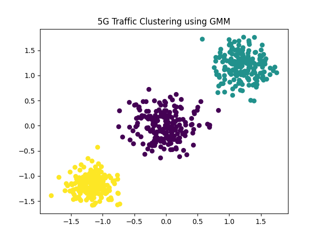

# Energy Efficiency in 5G Networks Using Gaussian Mixture Models

## Overview
This project applies Gaussian Mixture Models (GMM) to cluster synthetic 5G traffic patterns and simulate dynamic energy optimization.

The model automatically determines the optimal number of traffic clusters using Bayesian Information Criterion (BIC).

---

## Problem Statement
5G networks experience fluctuating traffic demand. Static energy allocation leads to inefficiency and power wastage.  
This project models traffic distributions probabilistically and estimates adaptive energy allocation strategies.

---

## Methodology
1. Synthetic traffic data generation (Low, Medium, High density)
2. Data scaling using StandardScaler
3. Model selection using BIC
4. Gaussian Mixture clustering
5. Energy estimation based on cluster intensity

---

## Model Selection Formula

GMM models the probability distribution as:

p(x) = Σ π_k N(x | μ_k, Σ_k)

BIC is used to balance model fit and complexity.

---

## Results
- Optimal number of clusters: 3
- Clear separation of traffic density groups
- Estimated dynamic energy consumption calculated

---

## Technologies Used
- Python
- NumPy
- Scikit-learn
- Matplotlib

---

## Conference Presentation
Presented at IEEE International Conference on Communication, Computing and Signal Processing (IICCCS) 2024.
## Visualization

